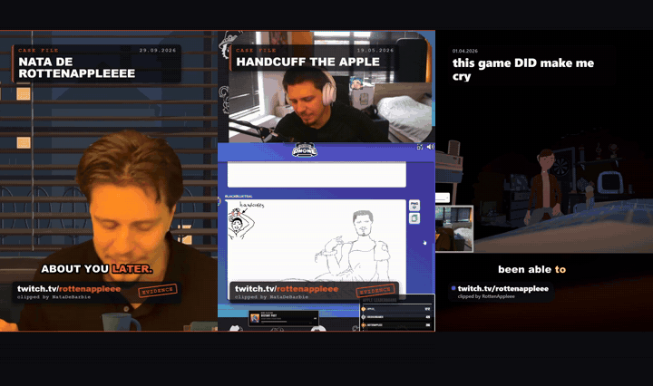
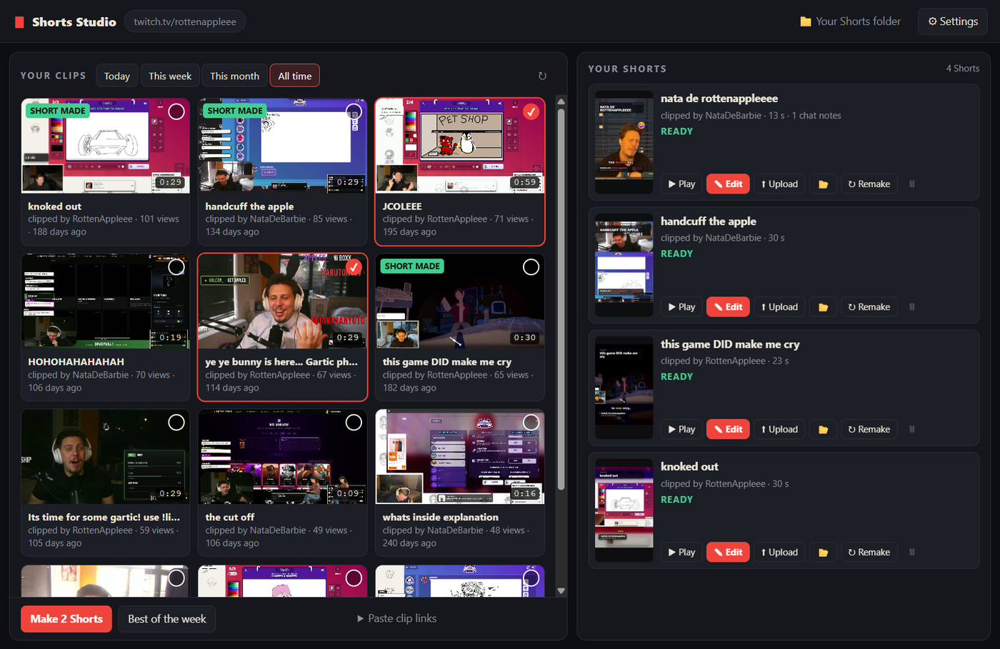
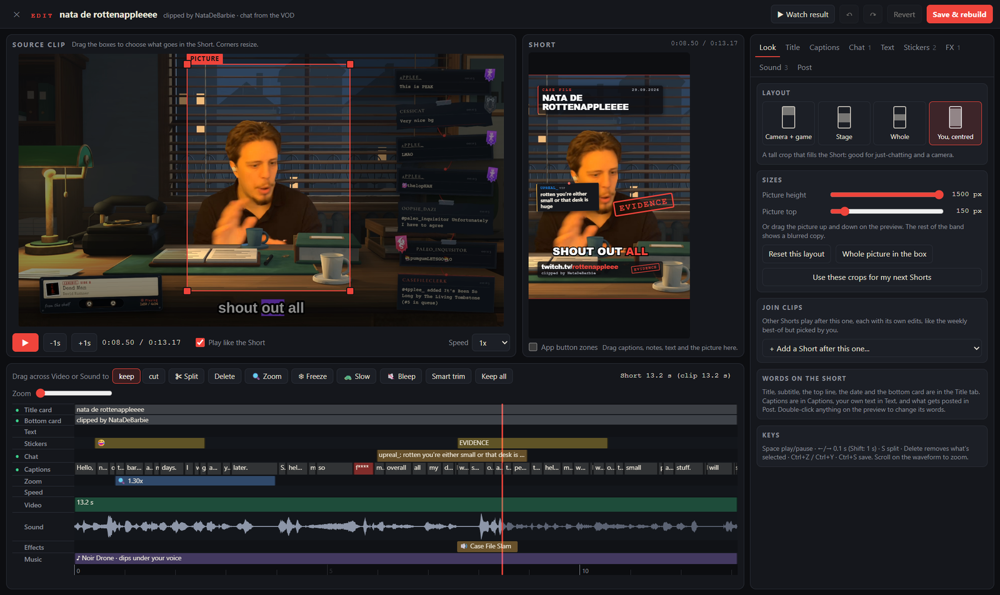
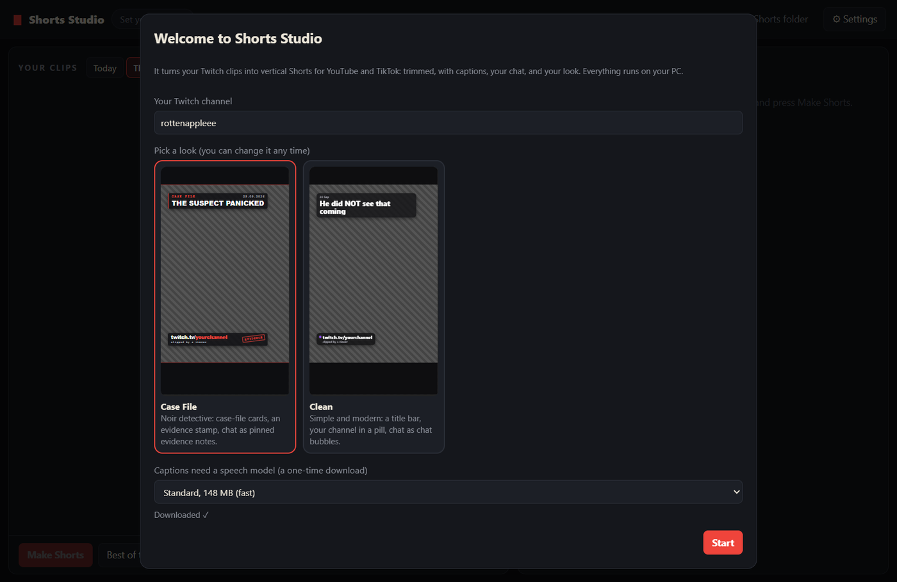
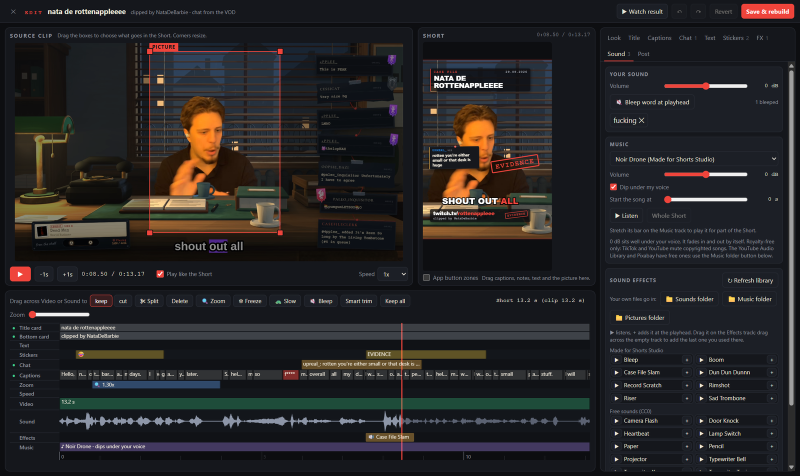
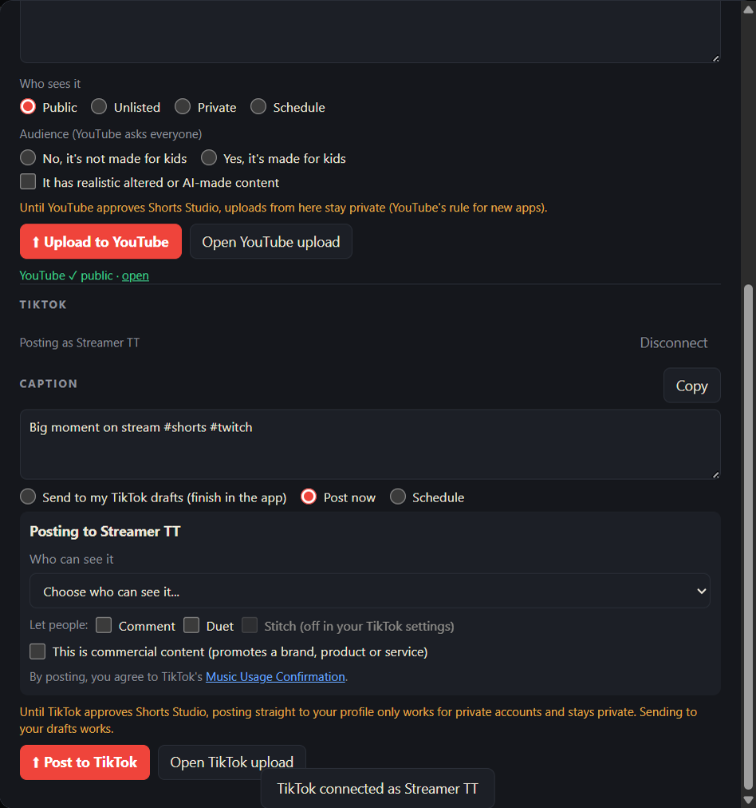

# Shorts Studio

Turns your Twitch clips into vertical Shorts for YouTube and TikTok: trimmed to the good part, with captions, your chat
on screen, and a look you pick. There's a full editor for when you want to change things. Everything runs on your own
PC. You don't need a Twitch login, API keys or an account anywhere.

**[⬇ Download for Windows](https://github.com/NikaDzotse/shorts-studio/releases/latest/download/Shorts-Studio-Setup.exe)** · [What it does, screenshots and help](https://byttenapple.com/assets/shorts-studio)



Left to right:
1. **Case File** look, "you centred" layout: an emoji, a zoom, a chat note from the VOD, an evidence stamp with a slam
   sound, a bleeped word and noir music.
2. **Case File**, "camera + game" layout.
3. **Clean** look.





## Install (Windows 10 or 11, 64-bit)

1. Download `Shorts-Studio-Setup-<version>.exe` from [Releases](https://github.com/NikaDzotse/shorts-studio/releases/latest)
   and run it.
2. Windows will probably show **"Windows protected your PC"**. The app isn't code-signed (a certificate costs money
   every year), so Windows doesn't know it yet. Click **More info**, then **Run anyway**.
3. Choose where to install it (the default is fine). You'll get a desktop shortcut.

## First start

- Type your **Twitch channel name** (the part after `twitch.tv/`).
- Pick a **look**:
  - **Clean**: a title bar, your channel in a pill, chat shown as bubbles.
  - **Case File**: a noir detective look. You can change the look and its colour in Settings at any time.
- Press **Start**. The first time, it downloads the speech model for captions (148 MB, once). You can pick the bigger
  "Best" model (466 MB) for better captions.



## Making Shorts

- **Your clips** shows your channel's clips from today, this week, this month or all time. Tick some and press
  **Make Shorts**.
- **Paste clip links** works for any channel's clips.
- **Best of the week** joins the week's top clips into one Short, about 10 s from each.
- Each Short takes about 20 to 40 seconds to make.

Every Short is saved to `Videos\Shorts Studio`. The **📁 Your Shorts folder** button opens it.

Chat on the Short comes from the stream's VOD. If your VODs are off or deleted, the Short has no chat.
Captions come from what's said in the clip.

## Editing

Press **✎ Edit** on a Short. The editor window has:

- **Timeline:** drag across the sound to keep or cut parts. Split, delete, and smart trim. Edges snap to where words
  start and end and to the playhead; hold **Alt** to place them freely.
- **Cuts:** every part that's cut out, and the ones you put back.
  - **Cut by words:** the clip's words as text. Select words (click, drag, or Shift+click) and press **Delete** to cut
    them out; **Put them back** undoes it.
  - Each cut has **Remove cut** / **Cut again**, exact **from / to** times you can type, and **▶ Check**, which plays
    across the cut the way the Short will.
  - On the timeline, a cut is a ✂ chip on the Video track: select it and press **Delete** (or double-click it) to put
    that part back. A part you put back keeps a dashed line under it; double-click the line to cut it again.
- **Keys for cutting:** **I** marks where a part starts and **O** where it ends (at the playhead). **X** cuts that part
  out, **Enter** keeps it, and **Esc** clears the marks. **S** splits at the playhead.
- **Look:** layout (camera + game, 4:3, whole picture, you centred), and drag the boxes to choose what's shown.
  "Use these crops for my next Shorts" remembers where your camera and game are.
- **Title:** the title card and the bottom card, including their words, position and when they show.
- **Captions:** fix any word, change timings, styles and colours, add emoji, bleep words.
- **Chat:** choose which chat messages show, reword them, and move them.
- **Text:** your own text on the Short.
- **Stickers:** emoji, arrows, circles, stamps, labels, your emotes, your own pictures.
- **FX:** zoom in on a moment, slow motion, freeze frame.
- **Sound:** your volume, sound effects, background music (it gets quieter while you talk).
- **Post:** the title, YouTube description and TikTok caption.
- **Join:** put other Shorts after this one.

Press **Save & rebuild** when you're done, then **▶ Watch result**. If the editor closes before you save (a crash,
or Windows restarting), reopening the Short offers to restore your unsaved changes.



Your own sounds, music and pictures go in the folders the Sound tab opens. Press **↻ Refresh library** after
adding files.

## Your editing presets

1. Edit a Short until its look is how you want it.
2. Open **Look → Presets**, enter a name such as **Gaming**, **Just Chatting**, or **Funny reactions**, and press
   **Save as new**. Saving a preset does not render a video.
3. In the main window, choose the **Editing preset** above **Your clips**, select clips, and press **Make Shorts**.
   The same selection applies to pasted links and **Best of the week**. Choose **Use Settings** for the ordinary defaults.

Presets include the layout and camera/game crops, theme and accent, caption style and position, title-card placement,
branding lines, caption/chat toggles, volume, and background music with its volume and ducking setting. Music covers
the new Short from its beginning, using the saved starting point within the track.

Each clip keeps its own title, transcript, dates, credits, cuts and timed effects. To restyle an existing Short,
choose a preset in **Edit → Look → Presets** and press **Apply**; **Undo** restores its previous look.
Press **Save & rebuild** to export the change.

To change a saved preset or its name, select it, edit the name/look, and press **Update preset**. **Delete** removes
the preset without changing finished or queued Shorts. Presets are saved in `%APPDATA%\Shorts Studio\presets.json`.
Music files stay in your library; if one is moved or deleted, choose a replacement and update the preset.

## Posting

Press **⬆ Upload** on a Short.

- **Drag it in:** drag the Short (from the upload window, or straight from its picture in your list) onto YouTube's
  or TikTok's upload page. **Open YouTube upload** / **Open TikTok upload** copy the title or caption first, so you
  just paste.
- **YouTube:** connect your channel once (Settings → Posting, or right in the upload window), then upload as public,
  unlisted or private, or **schedule** it. YouTube publishes it at that time even if your PC is off.
- **TikTok:** connect once, then **send it to your TikTok drafts** and post from your phone, **post now**, or
  **schedule** it. Shorts Studio has to be open at the scheduled time; if it isn't, the post goes out the next time
  you open it. TikTok asks you to choose who can see it, comments/duet/stitch, and whether it's commercial content.

Each Short shows how its posts went (uploading, done with a link, scheduled, or what went wrong). Your sign-in stays
on your PC, encrypted. Posting straight from the app is new: until YouTube and TikTok approve Shorts Studio, YouTube
keeps its uploads private and TikTok only allows drafts and private posts.



## Where things are

- **Your Shorts:** `Videos\Shorts Studio`.
- **Settings, the speech model and your library:** `%APPDATA%\Shorts Studio`.
- **Log:** Settings, then **Open the log**. It helps if something fails.

Uninstalling (Windows Settings, then Apps) keeps your Shorts and settings.

## Credits and licences

Shorts Studio uses these, all included in the installer:

- [Electron](https://www.electronjs.org/) (MIT)
- [FFmpeg](https://ffmpeg.org/) (GPL v3; the gyan.dev essentials build, source at https://www.gyan.dev/ffmpeg/builds/)
- [whisper.cpp](https://github.com/ggml-org/whisper.cpp) (MIT) with the OpenAI Whisper models (MIT)
- [yt-dlp](https://github.com/yt-dlp/yt-dlp) (Unlicense)
- [wavesurfer.js](https://wavesurfer.xyz/) (BSD-3)

Sounds: see `resources\sounds\CREDITS.txt` in the install folder. They're either made for the app or CC0.

Twitch, YouTube and TikTok are trademarks of their owners. Shorts Studio isn't made by or connected to any of them.
See the [privacy policy](https://byttenapple.com/assets/shorts-studio/privacy) and [terms](https://byttenapple.com/assets/shorts-studio/terms).

---

## For developers

```
npm install
npm run tools            # ffmpeg, yt-dlp and whisper.cpp into resources\bin
npm run tools -- --model # the base speech model into dev-models\ (tests)
npm start                # run it
npm run dist             # dist\Shorts-Studio-Setup-<version>.exe
```

- `npm run dist` runs electron-builder on the Node that ships inside Electron (electron-builder 26 needs Node 22).
- Tests:
  - `electron scripts/test-engine.cjs <clip slug> --channel <channel> [--edit] [--theme clean]` makes a Short with no
    windows.
  - `electron scripts/test-ui.cjs <shots dir> [--fresh] [--save]` drives the real windows off-screen and saves
    screenshots.
  - `node scripts/run-electron-node.cjs scripts/test-packaged.cjs <shots dir>` does the same with the built app in
    `dist\win-unpacked`.
  - `electron scripts/test-publish.cjs` tests posting against stand-in YouTube/TikTok servers; `electron scripts/test-posting-ui.cjs <shots dir>` clicks through the Upload window.
- Posting needs Shorts Studio's own Google and TikTok apps: see [docs/platform-setup.md](docs/platform-setup.md).

Code layout:

The offline preset integration test is `node node_modules/electron/cli.js scripts/test-presets.cjs`. It uses generated
clips, real windows and FFmpeg exports in a temporary data folder, and saves screenshots there.

- `main.cjs`: the app.
- `preload.cjs`: the `window.studio` bridge.
- `engine\`: making Shorts (Twitch, yt-dlp, whisper, ffmpeg).
- `ui\`: the main window and the editor.
- `themes\<id>\`: `frame.html`, `note.html` and `theme.json` for each look. To add a look, copy a folder.
